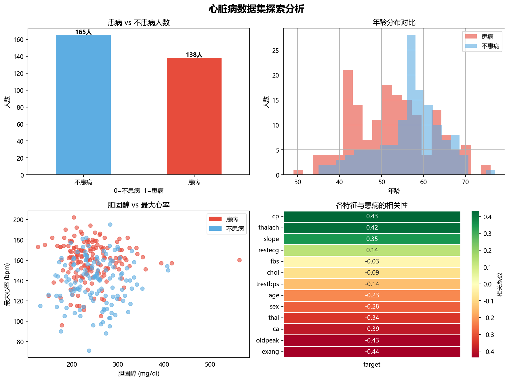
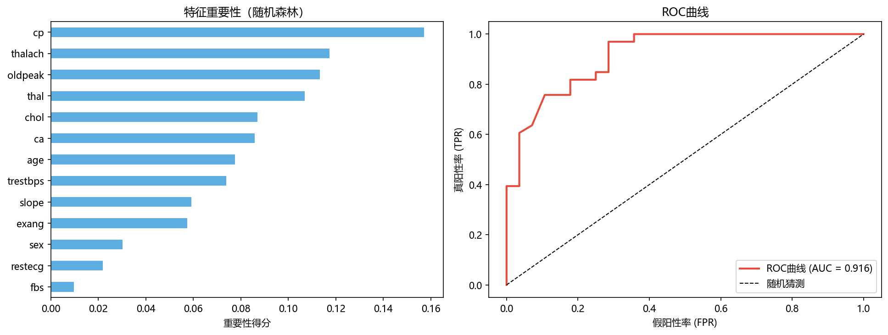

# 心脏病风险预测分析

基于303条临床数据，使用随机森林模型预测心脏病发病风险，AUC达到0.916。
结合智能医学工程专业背景，对关键特征进行了医学角度的解读。

---

## 项目概况

| 项目 | 详情 |
|------|------|
| 数据集 | UCI Heart Disease Dataset（303条，14个特征） |
| 技术栈 | Python / pandas / seaborn / matplotlib / sklearn |
| 核心算法 | 随机森林（Random Forest） |
| 模型AUC | **0.916** |
| 数据缺失 | 无缺失值，无需清洗 |

---

## 关键发现

通过相关性分析，发现与心脏病关联最强的3个特征：

| 特征 | 相关系数 | 医学解读 |
|------|----------|----------|
| exang（运动诱发心绞痛） | -0.44 | 运动时出现心绞痛是最强冠心病预警信号 |
| cp（胸痛类型） | +0.43 | 典型心绞痛患者（cp=0）患病风险反而更高 |
| thalach（最大心率） | +0.42 | 最大心率越高，心肺储备越好，患病风险越低 |

> 胆固醇（chol）相关性仅 -0.09，与临床直觉不符，
> 可能与样本量有限或混杂因素有关，需更大规模数据验证。

---

## 分析流程
**1. 探索分析**
- 患病率54.5%，类别基本均衡
- 患病组平均年龄略低于不患病组（约52岁 vs 57岁）

**2. 模型训练**
- 训练集/测试集 = 8:2（stratify分层采样，保证患病比例一致）
- 随机森林100棵树，random_state=42

**3. 模型评估**
- AUC = 0.916（优秀水平）
- 医疗场景中AUC比准确率更重要：衡量模型区分患病与健康人的能力

---

## 可视化结果

### 探索分析


### 模型结果（特征重要性 + ROC曲线）


---

## 局限性与改进方向

- 样本量较小（303条），结论需更大规模数据验证
- 可引入SHAP值进行更细致的特征解释
- 后续可尝试XGBoost/LightGBM对比模型效果
- 可部署为Gradio Web Demo，实现实时风险预测输入

---

## 运行方式

```bash
# 安装依赖
pip install pandas numpy matplotlib seaborn scikit-learn

# 打开Notebook
jupyter notebook heart_disease_analysis.ipynb
```

---

## 作者

智能医学工程专业 | 数据分析方向  
技术栈：Python · pandas · sklearn · Power BI · SQL
